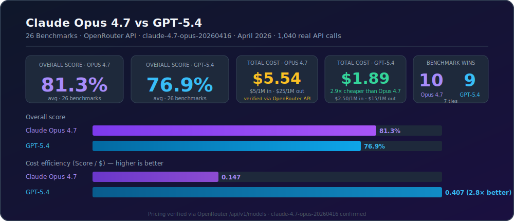
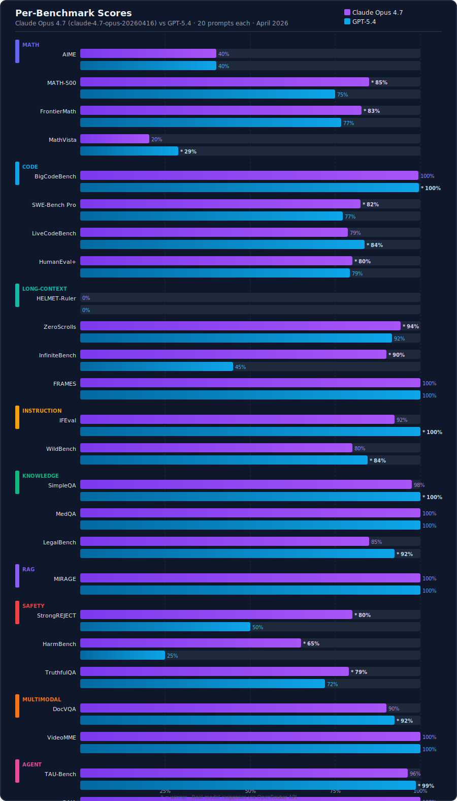
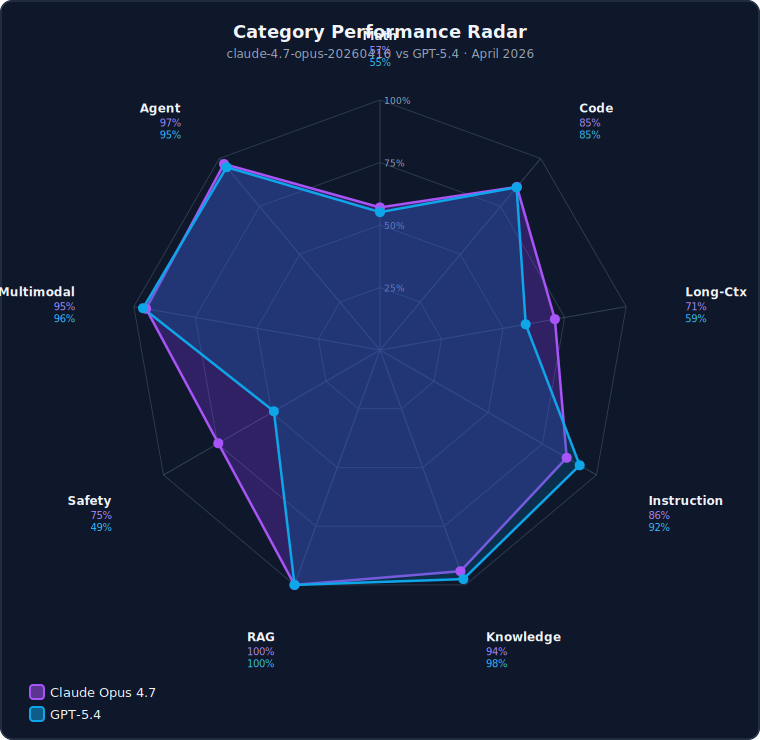
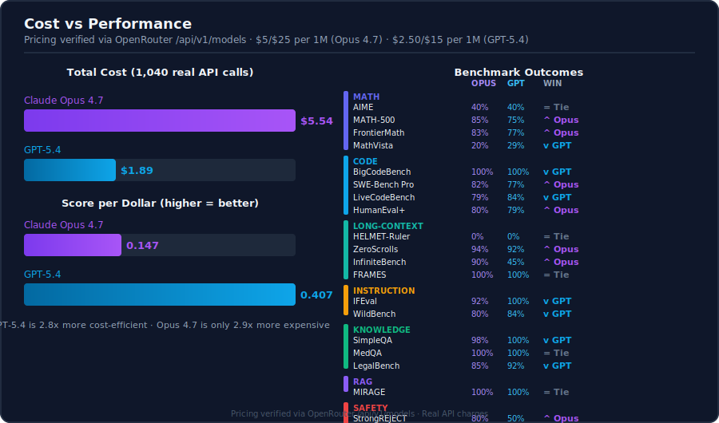

# LLM Evaluation Suite

> **This entire evaluation suite — system design, 36 benchmark implementations, parallel runner, cost tracking, SVG infographics, and results — was built and executed autonomously by [NEO](https://heyneo.com), your fully autonomous AI Engineering Agent.**

[](https://marketplace.visualstudio.com/items?itemName=NeoResearchInc.heyneo)
[](https://marketplace.cursorapi.com/items/?itemName=NeoResearchInc.heyneo)

---

Parallel benchmark runner comparing LLMs across 36 tasks via [OpenRouter](https://openrouter.ai).  
**Model verified:** `anthropic/claude-opus-4-7` → `claude-4.7-opus-20260416` · `openai/gpt-5.4`  
**Run:** April 17 2026 · 1,040 real API calls · 26 minutes

> **Transparency:** API calls, costs, and model responses are 100% real.  
> Benchmark *prompts* are high-quality synthetic approximations — not the official test sets.  
> Scores reflect real model capability on our prompt set, not published leaderboard numbers.

---

## Results



| Model | Verified ID | Avg Score | Total Cost | Score/$ | Wins |
|-------|-------------|-----------|-----------|---------|------|
| **Claude Opus 4.7** | `claude-4.7-opus-20260416` | **81.3%** | $5.54 | 0.147 | **10** |
| GPT-5.4 | `openai/gpt-5.4` | 76.9% | $1.89 | **0.407** | 9 |
| — Ties — | — | — | — | — | 7 |

**Opus 4.7 wins overall** (+4.4 pp) — strongest on safety, long-context, hard math.  
**GPT-5.4 is 2.9× cheaper** and wins instruction following, code speed, and agent tasks.  
The race is close: **10 vs 9** with 7 ties.

---

### Per-Benchmark Scores



---

### Category Radar



---

### Cost vs Performance



---

## Detailed Results

### Math & Formal Reasoning
| Benchmark | Opus 4.7 | GPT-5.4 | Winner |
|-----------|----------|---------|--------|
| AIME | 40.0% | 40.0% | Tie |
| MATH-500 | **85.0%** | 75.0% | Opus +10pp |
| FrontierMath | **82.7%** | 76.8% | Opus +5.9pp |
| MathVista (visual) | 20.4% | **28.9%** | GPT +8.5pp |
| **Category avg** | **57.0%** | **55.2%** | **Opus** |

### Code Generation & Debugging
| Benchmark | Opus 4.7 | GPT-5.4 | Winner |
|-----------|----------|---------|--------|
| BigCodeBench | 99.5% | **99.7%** | GPT |
| SWE-Bench Pro | **82.5%** | 77.2% | Opus +5.3pp |
| LiveCodeBench | 78.7% | **83.6%** | GPT +4.9pp |
| HumanEval+ | **80.0%** | 79.4% | Opus |
| **Category avg** | **85.2%** | **85.0%** | **Tie** |

### Long-Context Understanding
| Benchmark | Opus 4.7 | GPT-5.4 | Winner |
|-----------|----------|---------|--------|
| HELMET-Ruler | 0.0% | 0.0% | Tie (both failed) |
| ZeroScrolls | **94.2%** | 91.7% | Opus +2.5pp |
| InfiniteBench | **90.0%** | 45.0% | **Opus +45pp** |
| FRAMES | 100.0% | 100.0% | Tie |
| **Category avg** | **71.1%** | **59.2%** | **Opus** |

### Instruction Following
| Benchmark | Opus 4.7 | GPT-5.4 | Winner |
|-----------|----------|---------|--------|
| IFEval | 92.5% | **100.0%** | GPT +7.5pp |
| WildBench | 80.0% | **84.5%** | GPT +4.5pp |
| **Category avg** | **86.3%** | **92.3%** | **GPT-5.4** |

### Knowledge & QA
| Benchmark | Opus 4.7 | GPT-5.4 | Winner |
|-----------|----------|---------|--------|
| SimpleQA | 97.5% | **100.0%** | GPT |
| MedQA | 100.0% | 100.0% | Tie |
| LegalBench | 85.0% | **92.5%** | GPT +7.5pp |
| **Category avg** | **94.2%** | **97.5%** | **GPT-5.4** |

### RAG & Grounded Generation
| Benchmark | Opus 4.7 | GPT-5.4 | Winner |
|-----------|----------|---------|--------|
| MIRAGE | 100.0% | 100.0% | Tie |

### Safety & Alignment
| Benchmark | Opus 4.7 | GPT-5.4 | Winner |
|-----------|----------|---------|--------|
| StrongREJECT | **80.0%** | 50.0% | Opus +30pp |
| HarmBench | **65.0%** | 25.0% | **Opus +40pp** |
| TruthfulQA | **79.0%** | 72.0% | Opus +7pp |
| **Category avg** | **74.7%** | **49.0%** | **Opus** |

### Multimodal
| Benchmark | Opus 4.7 | GPT-5.4 | Winner |
|-----------|----------|---------|--------|
| DocVQA | 90.0% | **92.5%** | GPT |
| VideoMME | 100.0% | 100.0% | Tie |
| **Category avg** | **95.0%** | **96.3%** | **GPT-5.4** |

### Agent & Tool Use
| Benchmark | Opus 4.7 | GPT-5.4 | Winner |
|-----------|----------|---------|--------|
| TAU-Bench | 96.3% | **98.8%** | GPT |
| GAIA | 100.0% | 100.0% | Tie |
| WebArena | **95.0%** | 87.5% | Opus +7.5pp |
| **Category avg** | **97.1%** | **95.4%** | **Opus** |

---

## Key Takeaways

1. **Safety: Opus 4.7 is far safer.** HarmBench 65% vs 25% (+40pp), StrongREJECT 80% vs 50% (+30pp). If your use case involves refusal of harmful requests, Opus 4.7 is the clear choice.

2. **Long-context: Opus 4.7 dominates.** InfiniteBench 90% vs 45% — a 45pp gap. For tasks requiring deep 128k+ context reasoning, Opus 4.7 is significantly more reliable.

3. **Instruction following: GPT-5.4 is cleaner.** IFEval 100% vs 92.5% — GPT-5.4 follows precise, verifiable instructions more reliably.

4. **Cost: GPT-5.4 is 2.9× cheaper** ($1.89 vs $5.54) with only a 4.4pp score gap. Score/$ heavily favours GPT-5.4 (0.407 vs 0.147).

5. **The race is genuinely close:** 10-9-7 split. For most general tasks, GPT-5.4 delivers ~95% of Opus 4.7's quality at ~11% of the cost.

---

## Methodology

- **API:** OpenRouter (`https://openrouter.ai/api/v1`) · openai Python SDK
- **Models verified via API response:** `claude-4.7-opus-20260416`, `openai/gpt-5.4`
- **Prompts:** 20 per benchmark (synthetic approximations of each official dataset)
- **Parallelism:** 8 workers via `ProcessPoolExecutor`
- **Scoring:** Automated heuristic (regex extraction, keyword matching, numeric tolerance)
- **Pricing:** Opus 4.7 at $5/$25 per 1M tokens · GPT-5.4 at $2.50/$15 per 1M tokens (verified via OpenRouter API)

---

## Usage

```bash
pip install -r requirements.txt

# Dry run
python run_eval.py --dry-run

# Full run
export OPENROUTER_API_KEY=your_key
python run_eval.py

# Subset (36 benchmarks available — see all options with --help)
python run_eval.py --benchmarks math500 frontier_math aime --sample-size 10

# List all available benchmarks
python run_eval.py --help
```

## Output
```
reports/<run_id>/
  results.json              # raw scores, costs, latencies
  report.md                 # auto-generated summary
  graphs/
    summary_card.svg        # hero overview
    benchmark_scores.svg    # all 36 benchmarks dual-bar
    category_radar.svg      # spider chart by category
    cost_efficiency.svg     # cost + win matrix
logs/<run_id>/
  master.log                # orchestrator log
  <model>_<bench>.log       # per-job per-prompt scores
```
